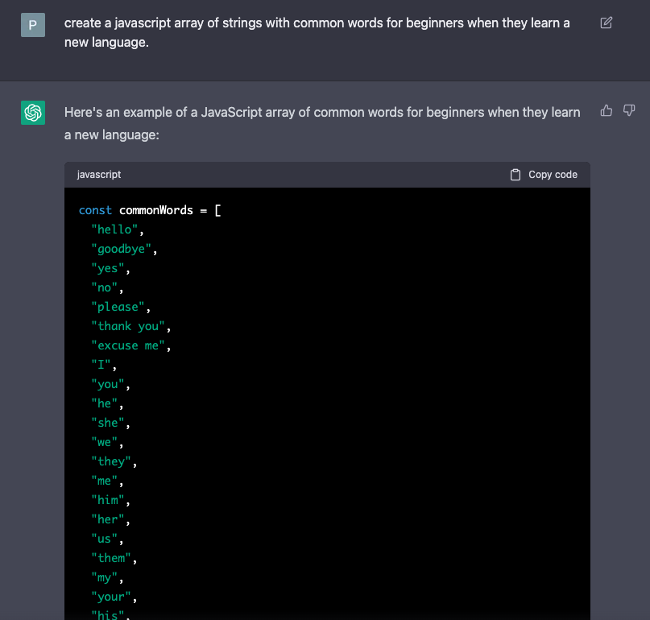
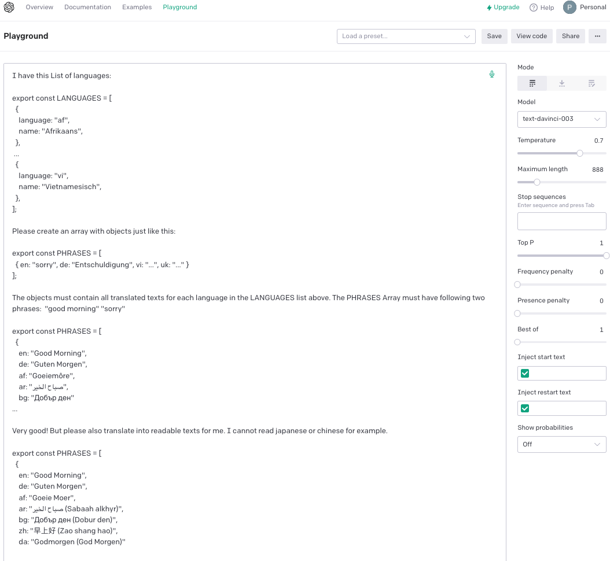

# hello-openai

Not just a hello world. Random greetings and phrases in a random language. Maybe a nice picture from the country. Try to build it with chatGPT.




## Bemerkungen zu chatGPT

1.  Mein Frontend Job ist gesichert: chatGPT ist nicht gut darin, visuelle Probleme zu beheben.
    Zum Beispiel: die Checkbox und das Label haben nicht dieselbe Höhe.

2.  Ohne den Code zu verstehen, lässt es sich nicht gut entwickeln. Deswegen ist die Frage nach
    Clean Code vs. Spaghetti Code abzuwägen. Das erfordert aber Zeit und somit verliert man die von chatGPT gewonnene Zeit.

3.  Der Code wird immer größer. Falls man den angefangenen Chat in chatGPT verliert, muss
    man ihm bei einem neuen chatGPT erst mal erklären, worum es geht. Ihr wisst mas ich meine, chatGPT verliert den Kontext.

4.  Ich fange jetzt alles in VueJS nochmal an. Der erste Versuch eine simple HTML&JS Website zu erstellen ist fehlgeschlagen,
    da der Code nicht so leicht erweiterbar ist.

5.  Man muss lernen die richtigen Fragen zu stellen, sonst bringt chatGPT keinen Zeitvorteil.

## Project Setup

```sh
npm install
```

### Compile and Hot-Reload for Development

```sh
npm run dev
```

### Type-Check, Compile and Minify for Production

```sh
npm run build
```

### Run Unit Tests with [Vitest](https://vitest.dev/)

```sh
npm run test:unit
```

### Run End-to-End Tests with [Playwright](https://playwright.dev)

```sh
# Install browsers for the first run
npx playwright install

# When testing on CI, must build the project first
npm run build

# Runs the end-to-end tests
npm run test:e2e
# Runs the tests only on Chromium
npm run test:e2e -- --project=chromium
# Runs the tests of a specific file
npm run test:e2e -- tests/example.spec.ts
# Runs the tests in debug mode
npm run test:e2e -- --debug
```

### Lint with [ESLint](https://eslint.org/)

```sh
npm run lint
```
